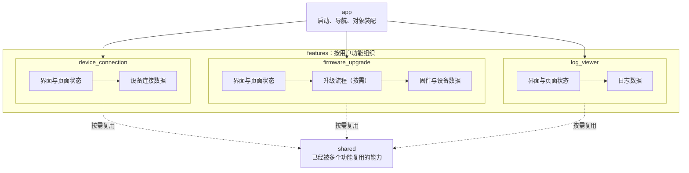
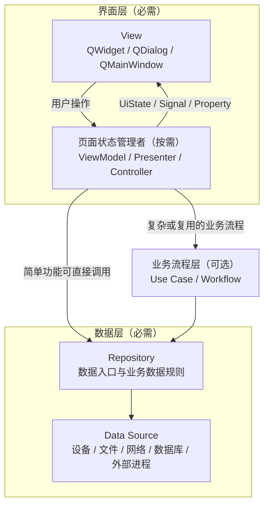
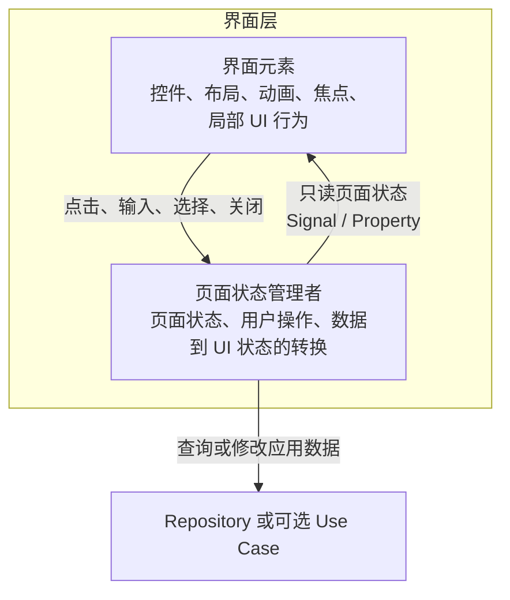
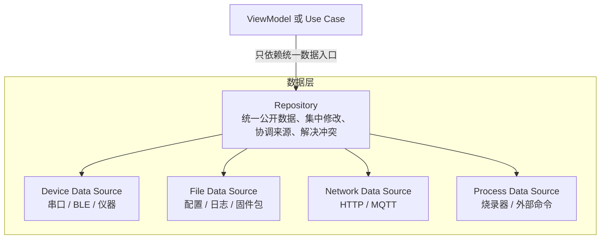
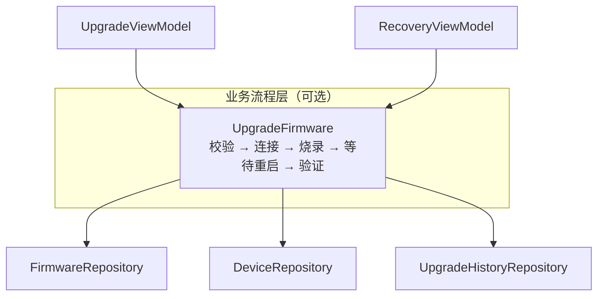

# Python + Qt 图形应用架构设计规范

> 状态：初始设计基线  
> 适用范围：以 Python 和 Qt 为技术基础的桌面图形应用  
> 参考思想：Android 官方应用架构指南及架构建议，并针对 Qt 桌面应用进行本地化重构

## 1. 文档目的

本规范用于指导 Python + Qt 图形应用的设计与演进。它关注应用功能、状态管理、数据流、并发和可维护性，不要求项目预先套用固定而繁重的分层结构。

本规范中的内容分为三个级别：

- **强烈建议**：默认应当遵循；只有与具体需求发生根本冲突时才调整。
- **建议**：通常有益，但应结合应用规模和复杂度决定。
- **可选**：仅在能够解决已经出现的问题时引入。

这些建议不是为了追求形式上的“架构合规”，而是为了使功能更容易理解、修改、测试和排查。若某项抽象不能降低真实复杂度，就不应仅为满足目录或层级形式而创建。

## 2. 平台定位

### 2.1 Qt 是既定的应用平台

本框架明确采用 Qt 作为图形界面和应用运行时基础，不把 Qt 视为需要隔离或随时替换的可选插件。

Qt 在本框架中负责：

- 窗口、页面、控件、样式和资源管理；
- 主事件循环以及对象生命周期；
- Signal/Slot 消息通知；
- 定时任务；
- 后台线程、任务调度和跨线程结果投递；
- 子进程管理；
- Qt 已提供且满足需求的网络、串口等 I/O 能力。

应用可以在 UI、页面状态管理和应用协调代码中直接使用 `QObject`、`Signal`、`Slot`、`Property`、`QTimer`、`QThread`、`QThreadPool`、`QProcess` 等 Qt 能力。不为假设中的“未来替换 Qt”增加抽象层。

### 2.2 Qt 优先的边界

当 Qt 已提供适合当前问题的机制时，优先使用 Qt 机制，而不是并行引入 Python 自带的另一套运行时机制。例如：

- 对象间通知优先使用直接方法调用或 Signal/Slot；
- 与界面生命周期相关的定时任务优先使用 `QTimer`；
- 需要与 Qt 事件循环协作的后台工作优先使用 `QThread`、`QThreadPool` 等；
- 子进程调用及其输出监听优先使用 `QProcess`；
- Qt 已提供并满足需求的设备或网络接口，优先使用对应 Qt 模块。

以下情况可以使用 Python 标准库或其他依赖：

- Qt 没有提供所需能力；
- Qt 的实现无法满足协议、性能、兼容性或部署要求；
- 代码属于纯数据、纯算法、协议编解码或其他不需要 Qt 生命周期的逻辑；
- 已有经过验证的第三方实现明显优于重新实现。

引入另一套线程、异步、事件或 I/O 机制前，应记录具体需求以及它与 Qt 事件循环的集成方式。

### 2.3 不滥用 Qt

承认 Qt 是平台，不代表所有类型都必须继承 `QObject`。

- 纯数据模型优先使用 `dataclass`、枚举或其他普通 Python 类型；
- 纯计算、格式转换、校验和协议编解码优先使用普通 Python 函数或类；
- 只有需要 Qt 生命周期、Signal/Slot、Property、线程归属或父子对象管理的类型才使用 `QObject`。

## 3. 总体设计原则

### 3.1 以功能为主要边界

应用首先按用户能够识别的功能进行组织，例如设备连接、固件升级、产测流程、日志查看和参数配置。

修改一个功能时，其主要代码应集中在该功能附近。禁止为了满足全局层级形式，把一个简单功能机械拆散到多个顶层目录。

建议的起点：

```text
src/
├── app/                         # 应用启动、导航和顶层装配
├── features/
│   ├── device_connection/      # 设备连接功能
│   ├── firmware_upgrade/       # 固件升级功能
│   └── log_viewer/             # 日志查看功能
└── shared/                     # 已被多个功能实际复用的能力
```

功能规模较小时，可以把 View、状态管理、数据访问放在同一功能目录中；复杂度增长后再在模块内部拆分子目录。

功能模块是项目的一级边界，界面、可选业务流程和数据访问是模块内部按需出现的职责：



图中的 `device_connection` 和 `log_viewer` 没有为了形式完整而增加业务层；`firmware_upgrade` 因流程较复杂，才增加独立的升级流程。不同模块可以有不同的内部深度。

### 3.2 分离关注点，但不追求固定层数

每个应用至少需要区分两类责任：

1. **界面责任**：显示应用状态、接收用户操作、管理窗口和控件生命周期。
2. **数据责任**：获取、保存、修改和公开应用数据，包括设备、文件、网络、数据库等数据来源。

当业务逻辑复杂，或者需要被多个页面复用时，可以增加独立的用例或业务服务。该部分是可选的，不是每个功能都必须存在。

```text
简单功能：View / ViewModel → Repository → Data Source

复杂功能：View / ViewModel → Use Case → Repository → Data Source
```

这里的箭头表示显式依赖或调用方向，不要求每次调用都经过全局消息总线。

典型功能内部的总体关系如下：



“必需”表示应用中必须存在这类责任，不表示每个功能都必须单独创建对应目录或类。简单功能可以合并相邻责任；只有复杂度出现时才拆开。

### 3.3 通过状态驱动界面

界面应根据明确的页面状态进行渲染，而不是从多个对象中临时拼凑状态。

例如固件升级页面可以定义：

```python
@dataclass(frozen=True)
class FirmwareUpgradeState:
    phase: UpgradePhase
    progress: int
    message: str
    can_start: bool
    can_cancel: bool
```

页面状态应能够直接回答“当前界面应显示什么”。加载中、成功、空数据、失败等互斥状态应明确表达，避免用多个可能互相矛盾的布尔值组合表示。

### 3.4 单一可信来源

每一种重要状态都必须有明确的唯一所有者。只有所有者可以修改状态，其他对象只能读取状态，或通过公开方法请求所有者修改状态。

示例：

- 设备连接状态由设备连接模块拥有；
- 当前升级进度由升级任务或升级页面状态管理者拥有；
- 用户持久化配置由配置 Repository 拥有；
- 控件自身的临时展开、选中、滚动位置可以由控件拥有。

禁止多个模块各自维护同一份可变状态，再依赖人工同步。

### 3.5 单向数据流

状态和用户操作沿相反方向流动：

```text
Repository / Task 产生数据
            ↓
ViewModel 生成页面状态
            ↓
View 根据状态渲染
            ↑
用户操作调用 ViewModel 的公开方法
```

典型流程：

```text
用户点击“开始升级”
    → View 调用 view_model.start_upgrade()
    → ViewModel 调用升级任务
    → 升级任务报告进度
    → ViewModel 生成新的 UpgradeState
    → Signal 通知 View 更新进度条
```

状态向界面流动；修改状态的意图从界面返回状态所有者。界面不得绕过所有者修改同一份业务状态。

## 4. 界面与状态管理

### 4.1 View 的职责

View 是 `QWidget`、`QDialog`、`QMainWindow` 或其他 Qt 界面对象，负责：

- 创建和组织控件；
- 显示页面状态；
- 收集点击、输入、选择和关闭等用户操作；
- 处理只与呈现有关的逻辑，例如焦点、滚动、动画和控件显隐；
- 遵循 Qt 对象和窗口生命周期。

View 可以包含简单的 UI 判断。只有决定业务结果、设备行为或持久化数据的逻辑才需要移出 View。

### 4.2 ViewModel 或页面状态管理者

复杂页面建议使用一个与页面生命周期对应的状态管理者。名称可以是 `ViewModel`、`Presenter` 或 `Controller`，但项目内应统一。

本规范默认使用 `ViewModel`，其职责是：

- 持有并公开页面状态；
- 接收 View 的用户操作；
- 调用 Repository 或可选 Use Case；
- 将返回的数据和错误转换为页面可以直接显示的状态；
- 管理与该页面对应、且不适合由控件独立管理的任务生命周期。

ViewModel 可以继承 `QObject` 并通过 Signal/Property 公开状态。Qt 依赖在这里是允许且正常的，因为它服务于页面状态和 Qt 生命周期。

简单页面不强制创建 ViewModel。若页面只有少量局部交互，且没有独立状态、后台任务或数据访问，可以直接在 View 中处理。

界面层内部包含“界面元素”和“页面状态管理者”两类结构。二者都属于界面层，允许直接使用 Qt：



简单控件状态可以留在 View；需要跨多个控件保持一致、需要访问数据或需要管理后台任务的页面状态，通常由 ViewModel 持有。

### 4.3 状态公开方式

建议 ViewModel 对外公开只读状态，并通过 Signal 通知状态变化。外部不得直接修改其内部状态。

```python
class FirmwareUpgradeViewModel(QObject):
    state_changed = Signal(FirmwareUpgradeState)

    def state(self) -> FirmwareUpgradeState:
        return self._state

    @Slot()
    def start_upgrade(self) -> None:
        ...
```

可以公开一个完整页面状态，也可以在页面包含多组互不相关的数据时公开多个独立状态。选择标准是让状态归属清楚，而不是强制所有内容塞进一个巨大对象。

## 5. 数据设计

### 5.1 Repository

Repository 是某类应用数据的统一入口，负责：

- 向应用其余部分公开数据；
- 集中处理数据的创建、读取、修改和删除；
- 协调缓存、设备、文件、网络等多个数据来源；
- 解决多个数据来源之间的冲突；
- 隐藏调用方不需要知道的数据来源细节。

例如：

- `DeviceRepository` 管理设备发现、连接状态和设备信息；
- `LogRepository` 管理日志读取、筛选和保存；
- `SettingsRepository` 管理用户配置的读取与持久化。

Repository 不要求必须定义接口。只有确实存在多个实现、需要稳定替换边界或测试替身时，再引入抽象协议或接口。

### 5.2 Data Source

Data Source 只负责一种具体数据来源，例如：

- 一个串口设备；
- 一个 HTTP 服务；
- 一个本地配置文件；
- 一个数据库；
- 一个外部命令行工具。

Data Source 负责与具体技术交互，不承担页面状态组织。若只有一个简单数据来源，且 Repository 只会形成无意义转发，可以暂时合并，待复杂度出现后再拆分。

数据层内部关系如下：



一个 Repository 可以协调零到多个 Data Source。调用方通常不应知道数据最终来自设备、缓存还是文件；但当只有一个简单来源时，不强制增加纯转发 Repository。

### 5.3 可选的 Use Case

以下情况可以引入 Use Case：

- 一段业务流程被多个 ViewModel 复用；
- 一个 ViewModel 中的业务编排已经明显过重；
- 流程需要独立测试、重试、取消或状态机；
- 流程同时协调多个 Repository。

每个 Use Case 表达一个清晰动作，例如 `UpgradeFirmware`、`ExportTestReport`。禁止为每个简单 Repository 方法机械创建同名 Use Case。

可选业务流程层用于封装一个完整动作，而不是成为所有调用的必经中转站：



当流程只被一个页面使用但已经具有明显的多步骤状态机、取消、重试或回滚责任时，也可以单独提取；如果只是一次简单查询，则 ViewModel 直接调用 Repository 更清楚。

## 6. 模块化与依赖

### 6.1 功能模块内部高内聚

一个功能模块应包含理解和修改该功能所需的大部分代码。模块只公开其他模块真正需要使用的入口。

功能模块之间优先使用：

1. 明确的公开方法调用；
2. 构造函数传入的依赖；
3. 在确有一对多通知或异步通知需求时使用 Qt Signal/Slot。

不得把全局 EventBus 作为默认通信方式。全局消息机制只用于真正跨模块、发送者不应知道接收者的一对多通知。

### 6.2 依赖注入

类应通过构造函数声明必要依赖，不在内部偷偷访问全局容器。

```python
class FirmwareUpgradeViewModel(QObject):
    def __init__(self, upgrade_service: FirmwareUpgradeService) -> None:
        super().__init__()
        self._upgrade_service = upgrade_service
```

默认在应用入口显式创建和连接对象。只有对象图复杂到手工装配已经成为现实问题时，才引入 DI 容器。

### 6.3 Shared 的准入条件

代码只有在被至少两个功能实际复用，并且具有稳定、清晰的共同语义时，才移动到 `shared/`。

禁止因为“以后可能复用”提前创建通用框架。两个功能中看起来相似但变化原因不同的代码可以暂时重复。

## 7. Qt 事件、线程和生命周期

### 7.1 主线程不可阻塞

所有控件创建和更新都在 Qt GUI 线程中完成。耗时 I/O、设备等待和长计算不得阻塞 GUI 线程。

执行耗时任务的类型应负责明确自己的并发策略，使调用方可以从 GUI 线程安全地发起操作，而不会冻结界面。

### 7.2 跨线程通信

跨线程结果、进度和错误优先通过 Signal/Slot 传递。使用 queued connection 时，Slot 会在接收对象所属线程的事件循环中执行。

后台对象必须有明确的线程归属、启动方式、取消方式和销毁责任。不得创建无法停止、无法等待退出或退出后仍可能更新界面的后台线程。

### 7.3 生命周期归属

每个长生命周期对象必须有明确所有者：

- 应用级服务由应用入口创建和关闭；
- 页面级 ViewModel 随页面创建和销毁；
- 页面任务在页面关闭后不得继续修改已销毁的界面；
- Qt 父子对象关系可以承担的销毁工作，应优先利用 Qt 的生命周期机制；
- 订阅、Signal 连接、定时器和线程在生命周期结束时必须停止或断开。

### 7.4 定时与等待

- GUI 线程中的周期任务使用 `QTimer`；
- 后台等待应可取消；
- 禁止在 GUI 线程使用 `time.sleep()`；
- 不使用高频轮询模拟 Qt 已能提供的事件通知。

## 8. 错误与恢复

错误应由能够理解并处理它的最近所有者负责：

- Data Source 把技术错误转换为明确异常或结果；
- Repository 补充数据语义和必要上下文；
- Use Case 决定重试、取消、回滚等业务策略；
- ViewModel 将最终结果转换为加载、成功、空数据或失败等页面状态；
- View 负责把状态呈现给用户。

不得静默吞掉异常。日志用于记录诊断信息；界面状态用于告诉用户发生了什么以及接下来可以做什么。二者不能互相替代。

## 9. 测试原则

优先测试稳定行为，而不是内部目录形式：

- 测试 ViewModel 接收操作后产生的状态；
- 测试 Repository 的数据规则和多数据源协调；
- 测试协议解析、校验和纯计算；
- 测试关键页面流程和导航；
- 测试后台任务的完成、失败、取消和关闭；
- 测试跨线程结果最终在正确的 Qt 线程处理。

测试替身优先使用行为清晰的 fake；只有需要验证交互次数或难以构造 fake 时才使用 mock。

## 10. 架构演进规则

新增功能时按以下顺序决策：

1. 先在独立功能目录内完成最小可用实现；
2. 为页面定义必要的状态和用户操作；
3. 将设备、文件、网络等数据访问集中到明确入口；
4. 只有 View 变复杂时才增加 ViewModel；
5. 只有业务编排复杂或出现复用时才增加 Use Case；
6. 只有两个以上功能出现稳定共同能力时才提取到 `shared/`；
7. 只有手工对象装配成为现实负担时才引入 DI 容器；
8. 只有确实需要广播时才引入全局事件机制。

架构应随真实复杂度逐步生长，不应在项目开始时一次性预建所有层级和抽象。

## 11. 反模式

以下做法默认视为设计警告：

- 为了“可替换”而隔离整个 Qt；
- 每个功能无条件创建 View、ViewModel、Use Case、Repository、接口和实现；
- 一个小改动必须横跨多个全局分层目录；
- 使用全局 EventBus 代替明确的方法调用；
- 在业务类中使用服务定位器隐藏依赖；
- 多个模块共同修改同一份可变状态；
- ViewModel 只是把调用原样转发给下一层；
- Repository 只是把调用原样转发给唯一 Data Source；
- 把页面所有控件状态集中进一个全局状态对象；
- 为通过静态规则而增加没有业务价值的包装层；
- 在 GUI 线程执行阻塞操作；
- 同时混用多套线程、异步或事件系统，却没有明确集成方案。

## 12. 设计评审问题

评审设计或代码时，优先回答以下问题：

1. 修改一个功能需要理解多少无关模块？
2. 每一份重要状态的唯一所有者是谁？
3. 用户操作如何到达状态所有者，状态又如何回到界面？
4. 哪些代码确实需要 Qt，哪些代码天然是纯 Python？
5. 后台任务由谁启动、取消、等待和销毁？
6. 这个抽象解决了已经存在的什么问题？
7. 删除某个转发层后，代码是否反而更清楚？
8. 当前设计能否在不启动完整 GUI 的情况下测试关键规则？

评审结论应以可维护性、状态一致性、线程安全和实际修改成本为依据，不以目录数量或层数为依据。

## 13. 参考资料与本地化说明

本规范吸收并重新表述了以下官方资料的核心思想：

- Android Developers：应用架构指南  
  <https://developer.android.com/topic/architecture?hl=zh-cn>
- Android Developers：有关 Android 架构的建议  
  <https://developer.android.com/topic/architecture/recommendations?hl=zh-cn>
- Qt Documentation：Signals & Slots  
  <https://doc.qt.io/qt-6/signalsandslots.html>
- Qt Documentation：Threads and QObjects  
  <https://doc.qt.io/qt-6/threads-qobject.html>

本规范不是 Android 文档的逐字复制。Android 的 Activity 重建、移动设备进程回收、Jetpack Compose、Hilt、Kotlin Coroutine 和 Flow 等平台特性，被转换为适合长期运行的 Python + Qt 桌面应用的规则。Qt 的事件循环、对象线程归属、Signal/Slot 和对象生命周期是本框架的直接设计基础。
